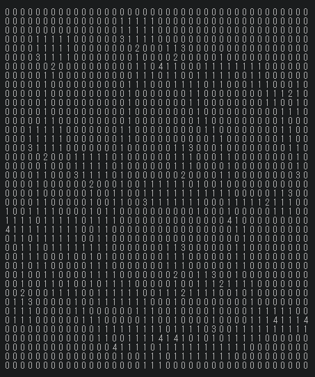

# laby
```
Random walk like an ants and paste the room on labyrinth.
```
```
再現性のあるランダム生成迷宮「laby」の特徴
１．階層化可能。始点と終点を指定できる。
２．全ての道と部屋が繋がる。部屋数は指定できる。
３．接続点は必ず移動可能。生成ロジックは一筆書きのように歩いている。
４．シード値による再現性がある。乱数生成器付帯。計算機や言語に依存せず、同一。
５．十分な複雑さがある。部屋生成ロジックは道の隙間を埋めるように配置している。
６．ドアが窪みドアの条件を満たす。窪みドアは、020並びが縦か横に必ず現れる。
７．生成結果は文字列で保存できる。
```
https://codepen.io/gnjo/pen/gObJLKx?editors=1010

```
//history 
v0.10 fix thinks the finishwork recovery. fail door and wildcard copy     
v0.11 fix map symbol definition. all map symbol the string.
v0.20 stp wildcard copy issue. wildcard symbol * is transparent. stop, wildcard copy dont need to use.
v0.21 fix multi os issue PI=3.141592653589793
v0.30 fix fail door recovery. if failed the door, change to road. "2" to "1".
v0.31 fix simple return. map[h][w]
v0.32 fix quality info laby.getquality, 0-100 low to high
v0.33 fix dont relation PI
v0.40 cod how to do the roundabout way.
```
```
//pug
script(src="https://gnjo.github.io/laby/xors.js")
script(src="https://gnjo.github.io/laby/mu.js")
script(src="https://gnjo.github.io/laby/laby.js")
```
```
//usage
let a=laby({/*opts*/});
let seed=100
let map=a.gen(seed) //or a.gen(seed,sx,sy,ex,ey)
document.body.style.fontFamily="monospace";document.body.textContent=mu.map2str( map )
```
```
//opts
laby({
size:[40,40] //[width,height]
,point:8 //random points number
,roomrange:[4,12] //[min,max] room range
,finerate:60 //0-100 fuzzy to strict
//
})
```

# note
```
実測値の精度。
一億回に一回程度のマップ生成失敗。finerateが低いと失敗しやすい。
部屋は二割程度の確率で失敗する。多くの場合は隙間がない。確実に部屋数を確保するには十分に考慮する必要がある。
```
```
オプションの指標。
point: 4~
size: [20~,20~]
finerate: 30~
roomrange:[Math.floor(1.2*(w*h/35)/4), Math.floor((w*h/9)/4)] //

部屋の最少コストは九、最大コストは三十五。マップのサイズをコストで割り、部屋の占有率として考える。
指標はマップ全体の四分の一程度。部屋が隙間にみっしり詰まる事は考えにくい。
縦横４０マスなら１０から４０部屋程度。部屋は二割程度の確率で失敗する事が判っている為、割り増す。
```
```
//0 is exist.
function is(d){return (d||d===0)?true:false}
```
```
//bad door recovery. door is 020 or vertex 020.
130   130
120 > 110
110   110

//welldone door pattern
*1*    *0*
020 or 121
*1*    *0*
```
```
getlookfront(map,x,y,v,depth)

depth4
012
345
678
9AB
-*-

v=W   v=E
258B-9630
147A+A741
0369-B852

```
```
//room pattern. the "3" is object, like a item.
000
030
000

00000
01130
00000

000
010
010
030
000

00000
01130
01110
01110
00000

0000000
0111110
0111110
0311110
0000000
```
```
//symbol is string
wall="0"
road="1"
door="2"
object="3" //object is room object
event="4" //join point
```



# mapctrl
https://codepen.io/gnjo/pen/OJPKQYp


to mu
```
o.lrot = a => a[0].map((_, c) => a.map(r => r[c]).reverse());
o.rrot = a => a[0].map((_, c) => a.map(r => r[c])).reverse();
o.getaround
o.getfront
o.r2a=(_k,_v)
```
```
//maskmap 0:view 1:foot 9:unknown. initialize is 9
let wa=mapwalk(map,maskmap,checkcallback)
 .jump(x,y,v)
 .walk('NEWS<>^v',keepbackflg)
 .slide('<>')
 .turn('NEWS<>^v')
 .getmap(w,h,opt) //'a','v','n'
 .getmaskmap(w,h,opt)
 .getv() //standing vector
 .getf() //front
 .getc() //standing char
 .getpos() //x,y,v,vo,c,f
```

# wire
https://codepen.io/gnjo/pen/XWJLgxd?editors=1010

```
wall="0" //face side
road="1" //ground
door="2" //face side
object="3" //ground
event="4" //ground
downstair="5" //ground
upstair="6" //ceiling

4L,4C,4R
3L,3C,3R
2L,2C,2R
1L,1C,1R
0L,0C,0R  //stand 0C

$wire //globalobject
{'4L':{w,d,c},...}
$wire['4L'].w //wallable
$wire['4L'].d //doorable
$wire['4L'].c='0' //0-6 //char

wireMake(w,h,ox,oy)//
wire(`
000
012
010
010
010
`)
;
console.log($wire)
```
